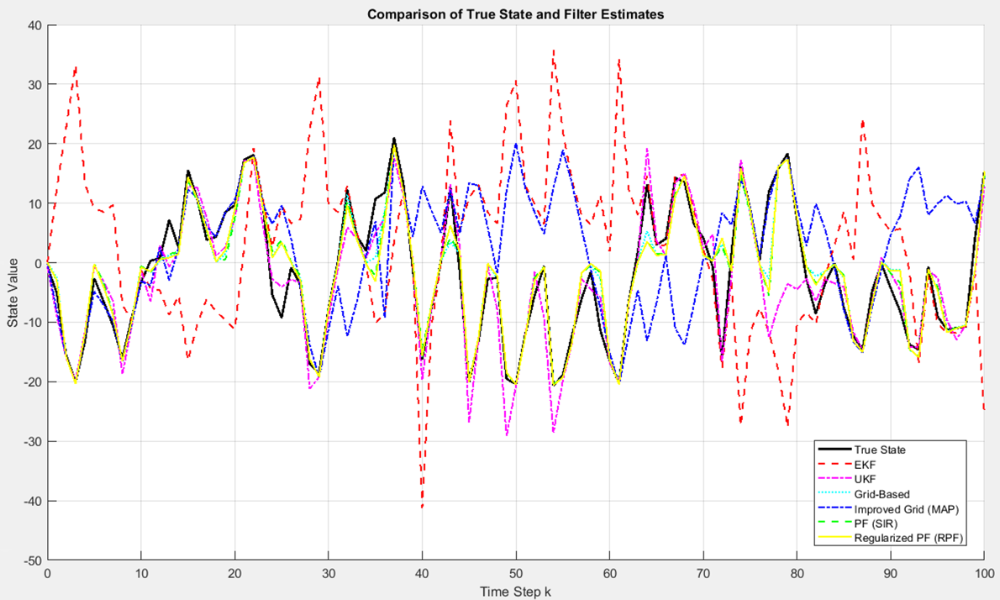
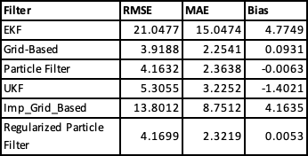

# 🔍 Optimal State Estimation using Kalman, Grid, and Particle Filters

This project implements and compares multiple state estimation filters for a **nonlinear, non-Gaussian dynamic system**, simulated in MATLAB. The filters are designed to estimate hidden states from noisy observations in systems where classical linear Kalman filters fail.

Author: Kruthika Yogeesh Gowda  
🛠️ Tools: MATLAB

---

## 🧠 Problem Definition

We consider a nonlinear discrete-time process:

- **State equation**:  
  𝑥ₖ = 0.5·𝑥ₖ₋₁ + (25·𝑥ₖ₋₁) / (1 + 𝑥ₖ₋₁²) + 8·cos(1.2·k) + 𝑣ₖ

- **Measurement equation**:  
  𝑧ₖ = 𝑥ₖ² / 20 + 𝑛ₖ

Where:
- 𝑣ₖ ~ 𝒩(0, 10) (Process noise)
- 𝑛ₖ ~ 𝒩(0, 1) (Measurement noise)

---

## 🧠 Implemented Filters

| Filter      | Description |
|-------------|-------------|
| **EKF**     | Linearizes the model using Jacobians (first-order approximation) |
| **Grid Filter** | Discretizes state space and applies Bayes update per grid cell |
| **Particle Filter (SIR)** | Sequential Importance Resampling with resampling |
| **RPF**     | Adds Gaussian noise to particles after resampling for diversity |
| **UKF**     | Unscented Kalman Filter using sigma points |
| **Improvised Grid** | Uses posterior peak (mode) from grid instead of mean |

---

## 📁 Repository Structure

Optimal-State-Estimation/
├── ekf.m
├── PF.m
├── Grid_based.m
├── RPF_output.m
├── UKF.m
├── Imp_Grid_based_output.m
├── README.md
├── plots - tables/
│ ├── EKF.png, PF.png, RPF.png, UKF.png, Grid_based.png, Imp_grid.png
│ ├── EKF table.png, PF table.png, RPF table.png, UKF table.png, Grid_based table.png, Imp_grid_table.png
│ ├── Basic_filters_comp.png, Basic_filters_table.png
│ ├── Advanced_filters_comp.png, Advanced_filters_table.png
│ ├── All_filters_comp.png, All_filters_table.png
├── evaluation_metrics/
│ ├── compare_basic_filters.m
│ ├── compare_advanced_filters.m
│ └── compare_all_filters.m

---

## 📊 Evaluation Metrics

We use 3 standard metrics to assess performance:

- **RMSE**: Root Mean Squared Error  
- **MAE**: Mean Absolute Error  
- **Bias**: Mean signed error (indicates over/underestimation)

### 🪄 Summary Table

| Filter                   | RMSE    | MAE    | Bias    |
|--------------------------|---------|--------|---------|
| EKF                      | 21.0477 | 15.0474 | 4.7749  |
| Grid-Based               |  3.9188 |  2.2541 | 0.0931  |
| Particle Filter (SIR)    |  4.1632 |  2.3638 | -0.0063 |
| UKF                      |  5.3055 |  3.2252 | -1.4021 |
| Imp_Grid_Based           | 13.8012 |  8.7512 | 4.1635  |
| Regularized Particle     |  4.1699 |  2.3219 | 0.0053  |

## 📈 Sample Plots

**All Filters Together**  


**Final Comparison Table (Image)**  


---


## ▶️ How to Run

1. Clone or download the repo in MATLAB.
2. Run any of the main estimation scripts:
   ```matlab
   ekf
   PF
   Grid_based
   UKF
   RPF_output
To evaluate and compare results, use:
evaluation_metrics/compare_basic_filters
evaluation_metrics/compare_advanced_filters
evaluation_metrics/compare_all_filters

⚠️ Output File Save Paths
Some scripts (e.g., RPF_output.m, Imp_Grid_based_output.m) include save commands like:

save('\\filestore.((location))\\RPF_output.mat', 'x_rpf');
🔁 Replace ((location)) with a valid path on your system.

Example:
save('C:\\Users\\YourName\\Documents\\RPF_output.mat', 'x_rpf');

This ensures that evaluation_metrics scripts can later load the saved files correctly.

